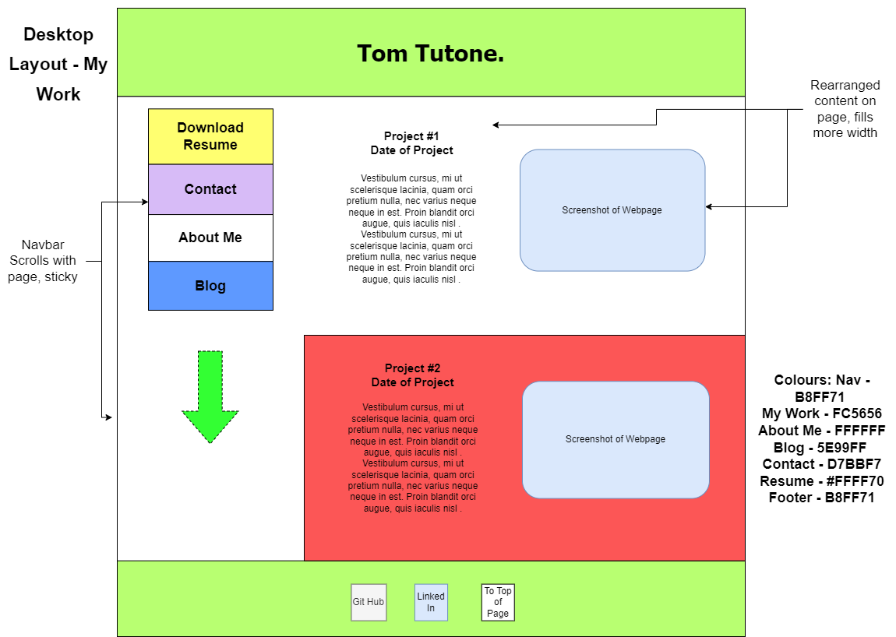

# Tom Tutone Term 1 Assignment 2: Portfolio

[My Portfolio Website](index.html)  
[My GitHub Repository](https://github.com/tthecoder15/TT-t1a2-portfolio)

## Purpose

When creating my portfolio website, my intention was to make an aesthetic and responsive website that exhibits my HTML and CSS skills as well as my design capabilities. The website was also designed to be neatly organised so that I can add to it as I complete more work that I can showcase. Finally, the website needed to be easy to use and engage on varying device sizes.

### Target Audience

The website is designed for users who are fluent using webpages on both mobile devices and desktop browsers. Because the website will primarily be used by prospective employers and peers in the coding industry, the target audience also is people who understand HTML and CSS functionality and aesthetics.

## Design

### Initial Sitemap

This is the initial sitemap that I designed. It was an immediate consideration that each webpage should link to every other one so that the user could easily navigate the website. Notably, this initial design lacks the idea that the individual blog posts should be separated via an index page.

### Final Sitemap

After creating my initial mobile wireframe designs, I updated my sitemap to have more detail. The final version features many more links, particularly the blog index which now links to five individual pages. Similarly, this diagram highlights how the "Download Resume" navbar option will only feature on specific pages.

### Mobile Wireframes

Below are the wireframes for mobile viewing of my portfolio website. I designed these before I created desktop wireframes as I expected the mobile dimensions to be more limiting. Each image below features annotations about that page's features and the intention of the layout.

Above is the initial design of the website's home page. I initially wanted to use a subdued but professional colour scheme, however, I found this styling generic and a little boring.

I redesigned my home page to feature vivid colours that convey the a clear visual key to the website's different features.

### Desktop Wireframes

Below are the desktop dimension wireframes of my portfolio website and annotations about each design choice.

Notably, I decided to have the individual blogs display in a single column rather than a side-by-side layout. This was to emphasise the importance of each individual blog and its content.

I decided to make the Contact page's content flow vertically. This was for visuall clarity and hierarchy.

### Colour Scheme

I tried to create a colour scheme that is bright and attention-grabbing so that users are excited to engage with the different webpages. Because the website is designed to pitch my personality to employers too, I chose colours that, together, are bright and imply a friendliness.

### Tech Stack

The website was designed using hand-drawn diagrams which were then digitised using [app.diagrams.net](app.diagrams.net). The website was built using HTML and CSS on VS Code.

## Functionality and Features

### Responsive Navigation Buttons

A key design feature of my portfolio website is a navbar that changes between pages and features large and colourful hyperlink buttons that respond to the viewport dimensions. Aesthetically, the buttons' colours add contrast to the webpage and make it easy to navigate. By distinguishing the different pages on the website in bold colours, the user quickly becomes aware of the website's diverse pages. Also in regards to the user's journey, the navbar is reordered based on the page that the user is viewing. For example, most of the website's pages feature the link to the "My Work" at the top of the navbar so that users are encouraged to look at it as soon as possible. However, on the "About Me" page, the top navbar item links to download my resume. This ordering is intended to compliment the page's content by contextualising the information about me with my job experience. Similarly, the individual blog pages feature the blog index page at the top of the navbar so that the viewer can easily continue engaging with the blog content. The reordering of the navbar should aid user flow through the website whilst also displaying my ability to create a responsive website.

The above and below screenshots show the different ordering of the navbar when navigating the website.

### Header and Footer  

The header and footer elements are reused across the website and are designed to create a cohesiveness across the website. The header, as well as adding a clear visual motif that frames each page, redirects to the home page whilst the footer echoes the colour motif and links the user to my GitHub and LinkedIn accounts as well. Finally, the third icon links to the top of the page. Each of these links is designed to direct the user to channels where they can engage with me in industry-standard ways whilst also making my website itself easier to explore.

### Interactivity

My website features various florishes of animation and interactivity to improve user experience. Prominently, the navbar buttons change colour and text boldness when highlighted. These choices were intended to emphasise how the user can engage with the page whilst also, hopefully, being an attractive design feature. Another interactive element when viewing the website in desktop mode is the sticky navbar. When a viewport of a certain screen dimension and ratio is used to view the website, the navbar will stick to the top of the screen as the user scrolls. This design choice was made to make the webpage easier to navigate because, otherwise, the user may find it annoying to scroll up each time they want to change pages. Also, it was chosen to emphasise my CSS skills as it is a decorative effect that is attention grabbing.

### Components

When coding the wireframes, I created a series of "template" components that were reuseable throughout the process. These include the header, a generic article styling, the navbar and the blog-index containers (seen below). I also defined graphical rules for portrait images, screenshots of my work, the footer and a generic image and figcaption element for new blog posts. These elements were all designed to be reuseable and scaleable so that I could easily make additions to the website.

